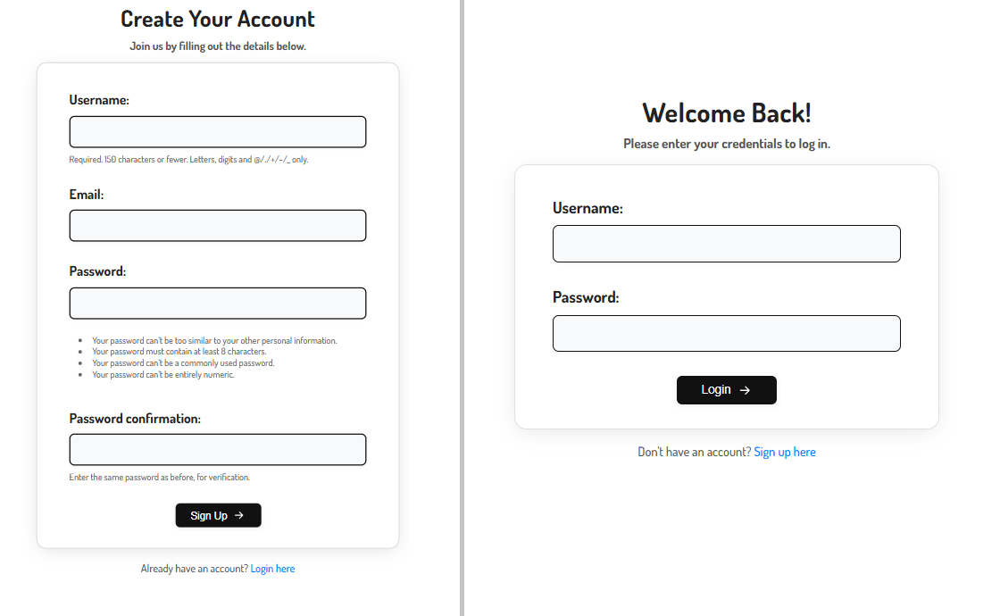
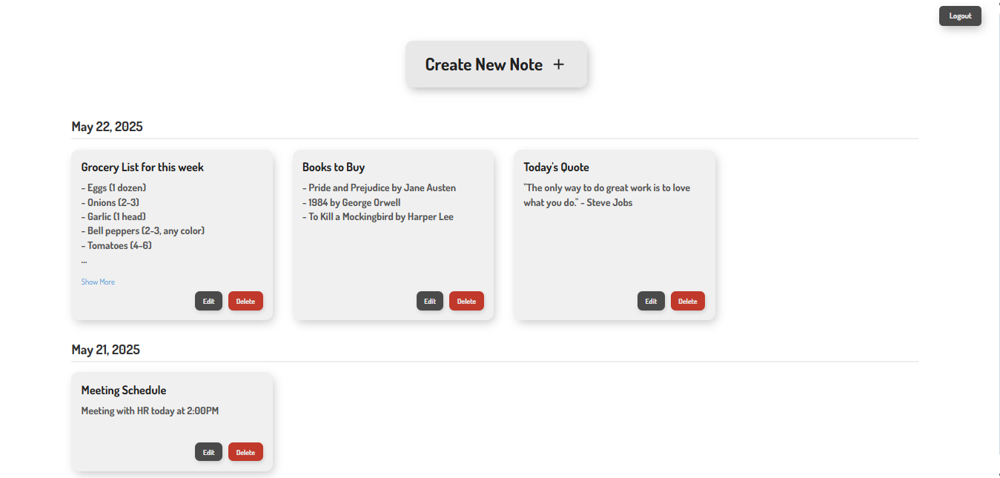

# Django Notes App

A simple yet effective web-based note-taking application built with the Django framework.

## Functionalities

This Django Notes App comes with the following features:

### User Authentication
*   **User Sign Up:** New users can register for an account to start creating and managing their notes.
*   **User Login:** Registered users can securely log in to access their personalized notes dashboard.
*   **User Logout:** Authenticated users can log out of their accounts.
*   **Page Protection:** Access to notes (viewing, creating, editing, deleting) is restricted to authenticated users. Unauthenticated users attempting to access these pages will be redirected to the login page.

### Notes Management (CRUD Operations)
*   **Create Notes:** Authenticated users can create new notes with a title and content.
*   **Read Notes:**
    *   Users can view a list of all their notes.
    *   Notes are conveniently grouped and displayed by date.
    *   For longer notes, a "Show More" / "Show Less" toggle allows users to expand or collapse the content.
*   **Update Notes:** Users can edit the title and content of their existing notes.
*   **Delete Notes:** Users can permanently delete notes they no longer need.

### User Interface
*   **Responsive Design:** The application features a clean and responsive user interface.
*   **Styled Forms:** User-friendly forms for creating/editing notes, signing up, and logging in.
*   **Interactive Note Display:** Notes are displayed in a grid layout, and individual notes can be expanded to view full content.

## Prerequisites

Before you begin, ensure you have met the following requirements:

*   Python (version 3.8 or higher recommended)
*   pip (Python package installer)
*   Git (for cloning the repository)
*   A virtual environment (Recommended to create a virtual environment for this project)

## Installation and Setup

Follow these steps to get your development environment set up:

1.  **Clone the Repository:**
    Open your terminal or command prompt and run:
    ```bash
    git clone https://github.com/talha-shafique/Django-Notes-App.git
    cd Django-Notes-App
    ```
2.  **Create and Activate a Virtual Environment:**
    It's highly recommended to use a virtual environment to manage project dependencies.
    Navigate to your project directory (`Django-Notes-App` or `notes`) if you're not already there.

    ```bash
    # For Windows
    python -m venv .venv
    .venv\Scripts\activate
    ```
    After activation, your command prompt should be prefixed with `(.venv)`.

3.  **Install Dependencies:**
    Install all the required packages listed in `requirements.txt`.
    ```bash
    pip install -r requirements.txt
    ```

4.  **Apply Database Migrations:**
    This command creates the necessary database tables based on your Django models.
    ```bash
    python manage.py migrate
    ```

5.  **Create a Superuser (Administrator):**
    This allows you to access the Django admin interface.
    ```bash
    python manage.py createsuperuser
    ```
    Follow the prompts to set a username, email (optional), and password.

6.  **Run the Development Server:**
    Start the Django development server.
    ```bash
    python manage.py runserver
    ```

7.  **Access the Application:**
    Open your web browser and navigate to:
    *   **Main Application:** `http://127.0.0.1:8000/`
    *   **Admin Interface:** `http://127.0.0.1:8000/admin/` (Log in with the superuser credentials you created).

## Project Structure

```
Django-Notes-App/
├── notes/                  # Django project configuration directory (contains settings.py)
│   ├── __init__.py
│   ├── asgi.py
│   ├── settings.py         # Main project settings
│   ├── urls.py             # Project-level URL routing
│   └── wsgi.py
├── noteapp/                # Django application for notes
│   ├── __init__.py
│   ├── admin.py            # Admin site configurations for this app
│   ├── apps.py             # App configuration
│   ├── forms.py            # Contains NoteForm and custom UserCreationForm (for signup)
│   ├── models.py           # Database models for this app (e.g., Note model)
│   ├── urls.py             # App-level URL routing for noteapp
│   ├── views.py            # Views (request handlers) for this app
│   ├── migrations/         # Database migration scripts
│   │   ├── __init__.py
│   │   └── 0001_initial.py # (and other generated migration files)
│   ├── static/             # Static files for the 'noteapp' application
│   │   ├── css/
│   │   │   └── style.css   # Main stylesheet
│   │   └── js/
│   │       └── main.js     # JavaScript for dynamic functionalities (e.g., show more)
│   └── templates/
│       ├── noteapp/        # Templates specific to the 'noteapp' application
│       │   ├── base.html          # Base template for common layout
│       │   ├── note_list.html     # Lists all notes for the user
│       │   ├── add_note.html      # Form to add a new note
│       │   ├── edit_note.html     # Form to edit an existing note
│       │   └── signup.html        # Custom user registration page
│       └── registration/     # Templates for Django's built-in auth views (overridden)
│           └── login.html         # Custom user login page
├── db.sqlite3              # SQLite database file (default for development)
├── manage.py               # Django's command-line utility
├── requirements.txt        # File listing project dependencies
└── README.md               # This file: project description, setup, etc.

```
## Usage

1.  Navigate to `http://127.0.0.1:8000/` in your browser.
2.  Register for a new account or log in if you already have one.
3.  Once logged in, you can start creating, viewing, editing, and deleting your notes.
4.  Explore different features as implemented.

## Contributing

Contributions are welcome! If you'd like to contribute, please follow these steps:

1.  Fork the Project.
2.  Create your Feature Branch (`git checkout -b feature/AmazingFeature`).
3.  Commit your Changes (`git commit -m 'Add some AmazingFeature'`).
4.  Push to the Branch (`git push origin feature/AmazingFeature`).
5.  Open a Pull Request.

